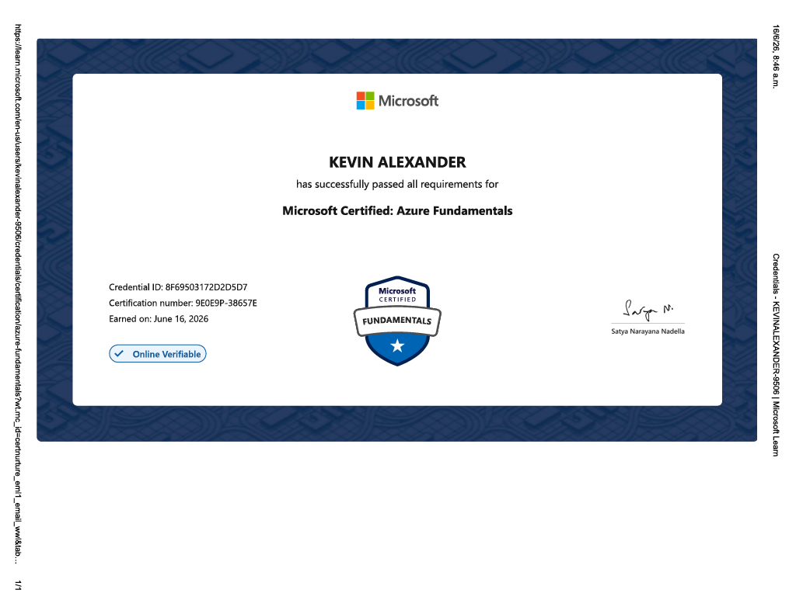

# Kevin Alexander Tibaquicha Ortiz

Engineering Systems and Computing Student (9th Semester)

Passionate about backend development, data analysis, machine learning and software engineering.

## Technologies

- ASP.NET Core
- C#
- C++
- SQL Server
- Entity Framework
- Python
- Flask
- PySpark
- Power BI
- Unity
- Git/GitHub

## Featured Projects

### SISBEN Vulnerability Analysis
Data mining and machine learning platform using SISBEN IV data and PySpark.

### GreenScope
Environmental monitoring and deforestation analysis platform.

### Sport Nutrition Platform
Web platform focused on nutrition, exercise and injury prevention.

### Accounting Management API
Backend accounting management system developed with ASP.NET Core.

### Historical Interactive Game
Educational Unity game focused on Colombian history.

## Contact

LinkedIn: https://www.linkedin.com/in/kevin-tibaquicha-ortiz-68a04b413/

Email: ktibaquichaortiz@gmail.com 

Microsoft Certified: Azure Fundamentals

